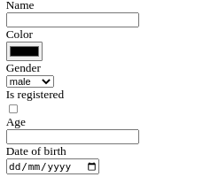

# form-lib

> A library to create html forms from schema like objects in javascript (inpired by you know which framework).

## Example

```js


let schema = {
    name: String,
    color:{
        type: String,
        specificType:'color'
    },
    gender: {
        choices:['male','female'],
        type:String,
        default:'male'
    },
    isRegistered: Boolean,
    age: {
        type: Number,
        min: 0,
        required: true
    },
    date_of_birth: Date
}

class MyForm extends Form {
    configure() {
        return {
            schema
        }
    }
}

console.log(new MyForm() + '')

```

Will generate

```html
<!-- Example form -->
<form>
    <div>
        <div><label for='name'>Name</label></div>
        <div><input type='text' name='name' id='name'></div>
    </div>
    <div>
        <div><label for='color'>Color</label></div>
        <div><input type='color' name='color' id='color'></div>
    </div>
    <div>
        <div><label for='gender'>Gender</label></div>
        <div><select name='gender' id='gender'>
                <option value='male' selected='selected'>male</option>
                <option value='female'>female</option>
            </select></div>
    </div>
    <div>
        <div><label for='isRegistered'>Is registered</label></div>
        <div><input type='checkbox' name='isRegistered' id='isRegistered'></div>
    </div>
    <div>
        <div><label for='age'>Age</label></div>
        <div><input type='number' required='required' min='0' name='age' id='age'></div>
    </div>
    <div>
        <div><label for='date_of_birth'>Date of birth</label></div>
        <div><input type='date' name='date_of_birth' id='date_of_birth'></div>
    </div>
</form>
```


## Usage

Depend on this library in the node environment or importing it in the browser (via the `FORM_LIB` global object).

```html
<form></form>
<script src="path/to/FORM_LIB/dist/index.js"></script>
<script>
    let Form = FORM_LIB.Form

    let schema= ...
    class MyForm extends Form {
        configure(){
            this.FormTag=false
            return {
                schema
            }
        }
    }
    let form = new MyForm
    document.querySelector('form').innerHTML=form.toString()
</script>
```

or

```js
let { Form } = require('@jsnodor/form-lib')

...

    res.send(form.toString())

...
```

## Capabilities

- Uses very simple configuration, the most basic of configuration requires you implementing the `configure` method

- Derived label names from `camelCase` or `snake_case`

- Has a private internal configurable API for future features

- Optionally ignore the form tag by setting `this.FormTag=false`

- Able to generate html in 3 modes, `paragraph` *(form.asP())*, `table` *form.asTable()* and `div (default)` *form.asDiv()*

- Able to fill the fields in the form based on the first argument of the form (incoming data)

- Does partial validation of date values

- Sets some html attributs `id`, `value`, `selected`, e.t.c (try out for more)

## Pending features

- Incorporate bootstrap css classes for the form

---
Special thanks to [@chilusoft](https://github.com/chilusoft), [@lembani](https://github.com/lembani),  & [@WazaDev](https://github.com/wazabanda)
